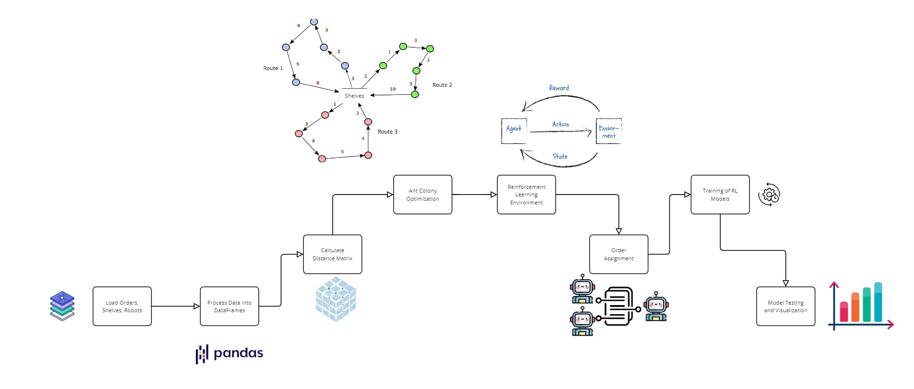

# Robotic Mobile Fulfillment System
The Robotic Mobile Fulfillment System (RMFS), which utilizes autonomous mobile robots to enhance efficiency in order picking and warehouse logistics. The problem areas they aim to address include:  Order allocation, Shelf selection Robot scheduling. This project implements a Robotic Mobile Fulfillment System (RMFS) utilizing Ant Colony Optimization for efficient path planning and visualization. The application is built using Streamlit for the user interface.

## Hosted Application

You can access the live application [here](https://rmfs-dpd.streamlit.app/).

## Architecture


## Setup Instructions

To set up and run this project locally, follow these steps:

1. **Clone the Repository**
   ```bash
   git clone https://github.com/your-username/Robotic-Mobile-Fulfillment-System.git
   cd Robotic-Mobile-Fulfillment-System
   ```

2. **Create a Virtual Environment**
   ```bash
   python3 -m venv venv
   ```

3. **Activate the Virtual Environment**
   - On macOS/Linux:
     ```bash
     source venv/bin/activate
     ```
   - On Windows:
     ```bash
     venv\Scripts\activate
     ```

4. **Install Dependencies**
   ```bash
   pip install -r requirements.txt
   ```

5. **Run the Application**
   ```bash
   streamlit run streamlit/app.py
   ```

## Contributing

Contributions are welcome! To contribute to this project, please follow these steps:

1. **Fork the Repository**
   - Click on the "Fork" button at the top right of the repository page to create your copy of the project.

2. **Create a New Branch**
   ```bash
   git checkout dev
   ```
   Or

   Create your feature branch
    ```bash
    git checkout -b feat/<name>
   ```

3. **Make Your Changes**
   - Implement your changes and test them.

4. **Commit Your Changes**
   ```bash
   git commit -m "Description of your changes"
   ```

5. **Push to Your Fork**
   ```bash
   git push origin dev
   ```

6. **Submit a Pull Request**
   - Go to the original repository and submit a pull request from your `dev` branch.

## License

This project is licensed under the [GNU GENERAL PUBLIC LICENSE](LICENSE).
